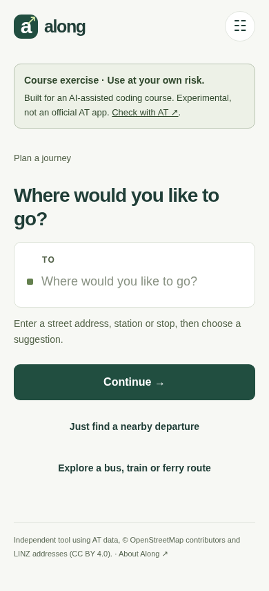
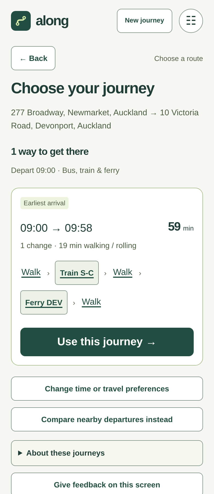
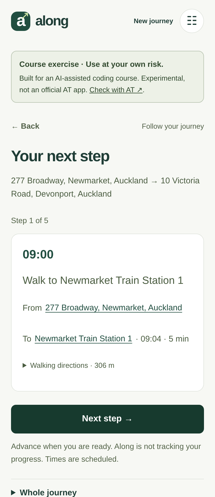
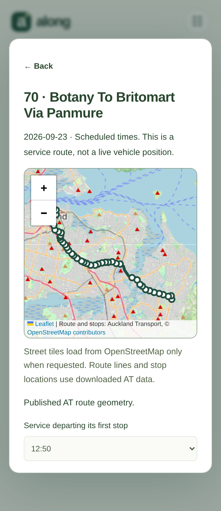
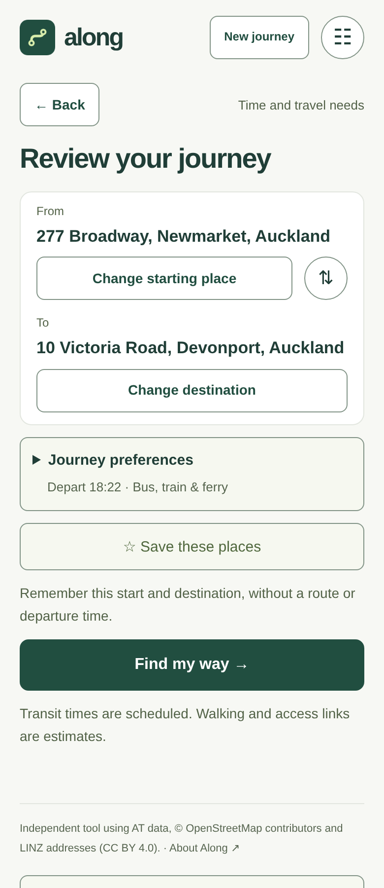
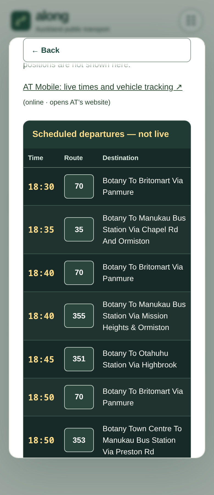

<h1> Along — your Auckland commute</h1>

> **Course exercise — use at your own risk.** Along was created as an exercise
> for an AI-assisted coding course. It is an experimental educational webapp,
> not an official Auckland Transport service. Routes, times, walking directions
> and accessibility information may be incomplete, outdated or incorrect.
> Check your journey and access requirements with AT before travelling.

An independent, installable webapp for finding a useful next ride and planning
street-address-to-street-address journeys across walking, buses, trains and ferries.
After the first download, address search and scheduled routing run in your browser,
including offline. **Once prepared, Along does not need the web portal to operate.**
**Your searches, saved journeys and preferences stay on your device.** No account
or uploaded journey history is needed.

Along uses Auckland Transport's public data and its own bounded routing engine.
It is **not an official AT app** and does not reproduce AT Mobile's journey planner.
**Offline planning is the foundation; live information is an optional addition.**
When connected, current AT predictions and alerts can help refine the scheduled
picture. The public app currently uses the downloaded timetable; its optional live
connection is not yet deployed. Losing connectivity will not remove offline planning.

<p align="center">
  <a href="https://reality2.ai/along/"></a>
</p>
<p align="center">Open in your browser and install on your device. Prepare it online, then plan scheduled journeys offline.</p>

## What drives the design

These principles come from the original brief and the user's repeated feedback
throughout development. They are the criteria for judging changes, not a claim
that every need has already been met.

- **Help with the situation at hand.** Make Auckland journeys intuitive using AT
  data: compare useful departures across nearby stops and lines, and plan from
  street address to street address across walking, bus, train and ferry.
- **Make the likely next action clearest.** Let the current task determine what is
  shown, almost like a wizard. Anticipate a useful next step without taking control
  or hiding alternatives.
- **Keep interaction calm and grounded in experience.** Apply calm computing,
  experiential cognition and progressive discovery: favour recognisable places,
  routes and actions over a busy dashboard. Reveal detail when it becomes useful.
- **Let people explore and return.** Make routes, vehicle/service numbers and stops
  entry points to paths, times and relevant maps—such as checking whether a service
  goes down Symonds Street. Back should preserve the journey and its context.
- **Learn routines while allowing something different.** Reduce repeated input,
  keep new journeys easy, and let people pause or erase learning.
- **Design for people with varied disabilities.** Support different ways of seeing,
  understanding and operating the interface, alongside walking and access needs.
  Keep unknown accessibility explicit and validate with people and assistive tools.
- **Work independently after preparation.** Support installed desktop and home-screen
  use, offline address search and routing, a recognisable icon and reliable reopening.
  Check for updates on refresh; when offline, fail quietly. The portal distributes
  the app, but is not required for downloaded routing to work.
- **Keep personal data under the person's control.** Searches, saved journeys and
  preferences stay on the device. Trusted-device synchronisation is a proposed
  extension, not a current feature; it must preserve local offline operation.
- **Require no coding by the human.** The human supplies intentions, constraints,
  feedback and real-device observations. The AI writes and changes the code, runs
  technical checks and resolves implementation problems. The course follows this
  same rule; programming knowledge is not a prerequisite.
- **Make the result reusable and the process teachable.** Provide public source,
  clear installation instructions across browsers and platforms, honest screenshots,
  and an account of decisions and corrections. This is a course exercise used at
  the user's own risk, with limitations visible in both the app and repository.

Read the [thematic analysis of this design conversation](docs/CONVERSATION_ANALYSIS.md)
for the evidence, interpretations, tensions and later refinements behind these
principles, and the [interaction principles](docs/INTERACTION_PRINCIPLES.md) for
how to apply them to each screen. WASM and hosting choices are possible means;
useful, accessible and independent operation is the goal.

## Project goal

**Finish Along as an intuitive, inclusive, installable Auckland commuter webapp,
and prepare it as a reproducible AI-assisted coding course example.**

The [full goal and completion criteria](docs/PROJECT_GOAL.md) preserve the user's
nine-part brief: interaction design, real journeys, inclusion, installation and
updates, browser independence, distribution, GitHub documentation, course material,
and release checks. The [release checklist](docs/RELEASE_CHECKLIST.md) separates
completed evidence from outstanding checks; public availability is not a claim
that all validation is complete.

## See Along in use

Actual app screens using public example addresses and the preserved Auckland
transport timetable. The route map shows downloaded AT geometry over an optional
online OpenStreetMap background, not live vehicle tracking. These views show the
interface after acknowledging the first-use course notice; the notice remains
available in the footer and Settings. Tap a screenshot to view it at full size.

<table width="100%">
<tr><th width="50%">Start with your destination</th><th width="50%">Choose a mixed-mode journey</th></tr>
<tr>
<td width="50%"><a href="docs/screenshots/01-start.png"></a></td>
<td width="50%"><a href="docs/screenshots/02-journey.png"></a></td>
</tr>
<tr><th>Follow one step at a time</th><th>Explore a route's path and stops</th></tr>
<tr>
<td width="50%"><a href="docs/screenshots/03-follow.png"></a></td>
<td width="50%"><a href="docs/screenshots/04-route-map.png"></a></td>
</tr>
<tr><th>Save places before choosing a route</th><th>Read scheduled stop departures</th></tr>
<tr>
<td width="50%"><a href="docs/screenshots/05-save-places.png"></a></td>
<td width="50%"><a href="docs/screenshots/06-departures.png"></a></td>
</tr>
</table>

Screenshots are reproducible with `node scripts/capture_ux.mjs` against a running
copy; set `CHROMIUM_PATH` if needed. All captures use the same viewport and pixel
dimensions. `CAPTURE_STREET_MAP=1` requests a street background for that one
presentation capture; automated tests do not fetch public street tiles. The **About Along** links in the footer and Settings open
this repository for source, installation help and the course material.

## What you can do

- Compare different lines at nearby stops, including estimated walking time at your pace.
- Search addresses or stops, compare journey options, then reveal steps and walking detail.
- Tap route badges to explore directions, branches, mapped paths and scheduled stop times.
- Open a stop for its location and upcoming scheduled departures; Back returns to your task.
- Save endpoints and your chosen bus/train/ferry service sequence; reopen with fresh scheduled departures.
- Let repeated searches suggest a routine; pause learning or clear it.
- Choose more walking time, avoid mapped steps/barriers, or require confirmed stop/vehicle access.
- Install on desktop or Android, and reopen with downloaded data when offline.
- Check for app updates by refreshing or returning to the app; offline checks stay quiet.

The design rule is: **make the user's likely next action the clearest option,
while keeping alternatives accessible**. See [interaction principles](docs/INTERACTION_PRINCIPLES.md).

## Install and try

Follow the [browser-by-browser installation and offline guide](docs/INSTALL.md)
for Chrome, Edge, Brave and Safari, covering Android,
iPhone/iPad, Windows, macOS, Linux and Chromebook. Install the icon, reopen it
online to finish preparation, then test it without a connection.

Open a hosted copy over HTTPS, wait for **Along · offline ready**, then use the
browser's **Install app** or **Add to Home Screen** action. On desktop Chromium,
installation is also offered in the address bar when eligible. On iOS, use Safari's
Share menu → Add to Home Screen; iOS device validation is not yet recorded.

Start with your destination: search a street number, street name and suburb, then
choose a suggestion and continue. Choose your starting place (or current location),
review **Journey preferences**, and select **Find my way**. **Use this journey**
opens one step at a time; advance explicitly when ready, or expand **Whole journey**.
Back preserves your entries. Other routes, nearby departures and saved journeys
remain available without crowding the current task. Settings shows offline readiness.

Open [Along at reality2.ai/along](https://reality2.ai/along/), or host the static
build below yourself. The four data bundles total approximately **38 MiB**;
uncompressed storage and memory are considerably larger. Browser storage can be
evicted. Do not rely on an expired timetable or mistake scheduled times for live
predictions. See [release evidence and limits](docs/RELEASE_CHECKLIST.md).

## Save places and optional service preferences

On the review screen, before choosing a route, **Save these places** remembers
just your start and destination. It does not save a departure time or itinerary.
Reopen the saved places from **Your usual journeys** to plan again.

After choosing a journey, **Prefer these services** can separately remember the
ordered bus, train or ferry numbers (and saves the places if needed). Reopening
then searches the current timetable for that combination, with freshly calculated
walking connections, boarding stops and departures. It does not track a particular
vehicle or retain the original departure time.

If no match is found within the four-hour search window and your travel
preferences, Along says so and offers other options. **Compare without saved
route preference** lets you explore freely. One preferred combination is stored
per endpoint pair; selecting another replaces it. Turning off **Preferred
services** keeps the saved places. Removing **Saved places** removes both.
Older saved places stay usable and acquire no service preference automatically.

## Explore a route or stop

Tap a route badge in a journey or nearby departures, or choose **Explore a bus,
train or ferry route** on the opening screen. Choose a direction/branch to see the
published AT path, full stop sequence and a scheduled service's stop times.
Filter stop names with a term such as **Symonds**. A street without a matching
stop name may still be on the path; this is not a street-intersection search.

Tap a stop name or map marker for its location and a departure-board view, clearly
labelled **Scheduled departures — not live**. The AT Mobile link opens AT’s website
for live times and vehicle tracking; it does not send Along’s saved journeys to AT. Back or
Escape returns through the detail layers without changing your planned journey.
Downloaded paths and stop locations work offline. **Show street map** in the centre of the map
adds an OpenStreetMap background on request; those tiles are not in the offline
bundle. Maps supplement the keyboard-accessible stop list.

Source repository: [reality2-ai/along](https://github.com/reality2-ai/along).
The source and course material are public. The app is hosted at
[reality2.ai/along](https://reality2.ai/along/); the hosting instructions below
also let you run your own copy.

## Run from source

Requirements: Python 3.10+, a current browser supporting service workers,
IndexedDB, module workers and `DecompressionStream`. Node 22+ is used for tests;
only the street-data import needs an extra Python dependency.

```sh
mkdir -p data
curl -fL https://gtfs.at.govt.nz/gtfs.zip -o data/gtfs.zip
python3 scripts/import_gtfs.py data/gtfs.zip
python3 scripts/import_addresses.py
python3 -m venv .venv
.venv/bin/pip install -r requirements-import.txt
curl -fL https://download.bbbike.org/osm/bbbike/Auckland/Auckland.osm.pbf -o data/auckland.osm.pbf
.venv/bin/python scripts/import_streets.py data/auckland.osm.pbf
python3 server.py
```

Open <http://localhost:3080>. `npm start` is a shortcut for the server. Imports
require an internet connection, disk space and more memory than running the UI.
Downloaded data is excluded from Git. See [data imports](docs/DATA.md) for refresh,
coverage, provenance and reproducibility.

## Static hosting and downloadable build

```sh
python3 scripts/build_static.py
```

This produces `dist/`, a ZIP in `releases/`, and a SHA-256 checksum. Upload the
**contents of dist** to an HTTPS static host, including the four `data/*.json.gz`
files and `.nojekyll` on GitHub Pages. Both `/` and a repository subpath are
supported. Serve `.gz` files as raw gzip bytes **without a Content-Encoding header**;
the browser worker decompresses them itself. Serve JavaScript as JavaScript, not HTML.

For a local preview: `python3 -m http.server 3082 --directory dist`. Localhost is
a development secure context; a phone needs HTTPS. A ZIP cannot be installed by
opening `index.html` as a `file://` URL. Host it first. Static hosting supplies
scheduled journeys; optional live API endpoints are absent by design.

The builder packages only public assets, public datasets and licence notices.
It does not package `.env`, agent conversations or private deployment settings.
See [hosting and restart setup](docs/HOSTING.md).

## Updates

The app offers **Update and reopen** after downloading a new interface. Settings
show the app version and **Check for an app update**. Opening, returning to,
reloading or pulling down from the top checks for an update, as does refreshing
nearby departures. Network failures during these checks are silent.

For an older cached installation, open `update.html` on the same site in the
browser used to install Along, choose **Check for updates**, read the version confirmation, then choose
**Open Along** and reopen the
installed app. Saved journeys and downloaded data are preserved.

App updates and data updates are separate. Refresh the host's data imports and
redeploy, then choose **Update downloaded timetable** in settings to download the
host's timetable, streets and addresses. This button does not fetch a new GTFS ZIP
from AT or run an importer. All open tabs should be reloaded after an app update.

## Optional live AT data

Register through the [AT developer portal](https://dev-portal.at.govt.nz/), subscribe
to the relevant realtime API, copy `.env.example` to `.env`, set `AT_API_KEY`, and
restart `server.py`. The Python proxy sends the key in a server-side header. Never
put it in browser JavaScript or a static build.

Nearby departures use matching live predictions when available; expired or failed
feeds fall back to labelled schedules. **Journey itineraries remain scheduled.**
Route details and stop-detail timetables also remain scheduled. Live data can add
arrival predictions, reported cancellations and alerts; AT also offers vehicle
positions, but Along does not yet display live vehicles or replan around delays.
The adapter is fixture-tested; authenticated verification remains pending a key.
See [AT realtime documentation](https://dev-portal.at.govt.nz/realtime-api).

## Limits and accessibility

- Urban street/address coverage is bounded by longitude 174.45–175.05 and latitude
  −37.15–−36.66. The transit feed covers a larger area; not every regional address
  or ferry destination has a downloaded walking network.
- Routing searches four hours ahead with up to three changes and bounded access
  walks. It returns a limited set of options, not every route or a guaranteed optimum.
- Mapped walking paths include short estimated links to buildings and platforms.
  Nearby lookup examines up to 18 stops within 800 m and two hours of departures;
  mapped walks are limited to 20 minutes. Catchability is an estimate.
- Avoiding mapped barriers does not verify kerbs, lifts, surfaces or current access.
  The current AT feed marks wheelchair access as unknown; requiring confirmed
  access can therefore return no verified journey. Unknown does not mean accessible.
- No fares, booking, live turn-by-turn tracking or journey-specific disruption rerouting.
- Automated accessibility checks do not certify universal usability. Read the
  [accessibility checks and device checklist](docs/ACCESSIBILITY.md).

## Privacy

Searches, saved journeys and preferences stay in browser storage. Learning reflects
successful searches, not proof of trips taken. Location is requested explicitly
and used locally. There is no analytics service or background journey tracking.
The host still receives ordinary asset/API requests; external AT links contact AT.
Choosing the online street background sends visible map-tile requests to
OpenStreetMap, revealing the viewed area and ordinary connection metadata.
There is no cross-device synchronisation; the [Reality2 design](docs/R2_SYNC_DESIGN.md)
is a proposal, not an implemented feature.
Clearing browser site data removes the stored routes and offline datasets.

## Development and verification

```sh
npm ci
npx playwright install chromium
npm test
# Start python3 server.py in another terminal, with datasets imported:
npm run test:browser
npm run test:updates
npm run build
npm run test:static
python3 test/check_route_exploration.py
```

Set `CHROMIUM_PATH` to use an existing Chromium. `TEST_BASE_URL` selects a different
local server for the browser suite. Real-data tests use 23 September 2026; update
fixtures when the feed no longer covers that date. Synthetic unit tests do not
need downloaded data. See [architecture](docs/ARCHITECTURE.md), [performance evidence](docs/PERFORMANCE.md),
[contributing](CONTRIBUTING.md), and [release evidence](docs/RELEASE_CHECKLIST.md).

## AI-assisted coding course

Start with the [course guide](docs/COURSE_GUIDE.md) and
[thematic analysis of the conversation](docs/CONVERSATION_ANALYSIS.md). They cover
how concrete user feedback changed the requirements, the mistakes uncovered by
verification, and how to distinguish implemented behaviour from supported claims.
The optional [portable AI launcher](docs/AI_LAUNCHER.md) is separate from the app.

## Licence and data credits

Original code, artwork and course material: [MIT](LICENSE).
Transit data: Auckland Transport, CC BY 4.0. Addresses: LINZ, CC BY 4.0.
Walking database: © OpenStreetMap contributors, ODbL 1.0.
Map renderer: Leaflet 1.9.4, BSD 2-Clause (vendored licence included).
These dataset licences are separate from the code licence. Keep the
[full source and transformation notices](NOTICE.md) with redistributed builds.
