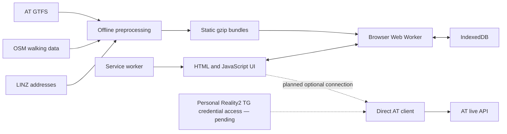

# Architecture and boundaries

The solid offline path is deployed. The dotted live connection is not enabled:
the direct AT client is implemented and browser-verified, while the TG credential
path is still under investigation. No Along-operated server is required or planned
for public live access. See [integration evidence](REALITY2_INTEGRATION.md).

## Files and responsibilities

| File | Responsibility |
| --- | --- |
| `public/app.js` | Form state, suggestions, results, progressive disclosure and local preferences |
| `public/planner.js` | Timetable filtering, connection scanning, transfers and nearby departures |
| `public/explore.js` | Route/branch patterns, full trip stop times and stop departure queries |
| `public/streets.js` | Address search, graph snapping and directed walking paths |
| `public/worker.js` | Data download, decompression, persistence and routing requests |
| `public/preferences.js` | Saved journeys and transparent repeated-search heuristics |
| `public/sw.js`, `public/updates.js` | Offline shell and explicit update activation |
| `public/at-client.js` | Direct AT requests and provider JSON conversion; no credential persistence |
| `public/live-client.js` | Explicit reads, caching, expiry, cancellation and quiet failure |
| `public/live-predictions.js`, `public/live-vehicles.js`, `public/live-context.js` | Strict contextual matching of predictions, positions and alerts |
| `server.py`, `lib/realtime.py`, `live_proxy.py` | Local/development hosting and retained proxy experiment; not the planned public architecture |
| `scripts/` | Reproducible preprocessing, icons and static packaging |

The browser performs scheduled planning independently. Legacy server planning
endpoints remain for development, but are not required by the UI or public build.

## Planning limits

The transit planner scans active connections in a four-hour window, including
previous/next service-day departures around midnight. Up to four boardings produce
at most three changes. Pickup, drop-off and transfer rules constrain boarding.
Walking access and egress use bounded graph reachability; transfer walks use a
10-minute graph limit plus transfer/boarding buffers. Some explicit GTFS station
links remain estimated rather than street-verified.

The engine keeps a limited set of earliest-arrival labels and options. Sorting
returned options by walking or changes does not establish a globally optimal
solution for that criterion. No fare optimisation, realtime itinerary rerouting,
booking or ongoing navigation progress is implemented.

Street routing uses directed graph edges and selected barrier flags. Address and
stop points snap to nearby nodes within 120 m, favouring a matching street name
for addresses. Those access connectors are estimated and can miss entrances or
cross barriers that are absent from the map. Never present them as verified access.

Nearby lookup starts with up to 18 geographically close boarding stops within
800 m. With a downloaded graph it excludes disconnected stops and walks over
20 minutes, and uses the selected pace. Before graph loading, it uses explicitly
labelled distance estimates. A two-minute buffer informs the “tight” label, not a
promise that the service can be caught.

## Independence and privacy

IndexedDB stores the timetable, streets and addresses. localStorage stores
journey preferences. A service worker caches a versioned shell. Update activation
is explicit so an arriving version does not reload a journey unexpectedly.
Native reload, a downward pull, returning to the app and nearby refresh check for
updates; offline/unreachable checks fail quietly.

The worker keeps computation off the interface thread. JavaScript already meets
the tested desktop scenarios; measurements are recorded separately from claims
about phones. WASM is an option if profiling identifies a useful bottleneck.
WASM may host a local runtime, but does not bypass browser network restrictions
or protect a shared API key shipped to every browser. AT allows the direct
cross-origin requests verified in the integration evidence; credential access
and protection remain separate responsibilities.

## Changes requiring care

- Change the shell cache version whenever shipping modified cached assets.
- Preserve saved preferences and offline data through app upgrades.
- Version incompatible dataset schemas and preserve usable data on failures.
- Never bundle a shared AT key, `APIKey` or `.env`. Keep personal credential access
  separate from exports, feedback, ordinary preferences and public assets.
- Test real data and synthetic edge cases. Neither alone proves routing quality.

## Contextual exploration and maps

Route badges and stop names open nested, labelled detail dialogs. Browser history
tracks depth; Back/Escape restore the previous layer and initiating control.
Journey inputs and manual progress are not changed by exploration. A route search
is an alternative on the destination screen. Variant lists separate stop sequences
and published shapes so branches are not flattened into one misleading line.

`routes.json.gz` contains AT shape coordinates and trip-to-shape references. The
worker stores it in IndexedDB and pairs it with scheduled trips. Leaflet 1.9.4 is
vendored locally. Route paths and stop markers need no external map service;
street background tiles are a separate, explicit online action. Stop-name search
is not a geometric street-intersection test and says so in the interface. Maps
have parallel stop lists with scheduled times and keyboard-operable detail links.

## Installation documentation

`docs/INSTALL.md` is the installation/privacy guide's source. The build runs
`scripts/render_install_guide.py` to produce `public/install.html`; this small
renderer supports the Markdown subset used by the guide. Browser sections are
native disclosures. The service worker caches the guide, and the archive also
contains INSTALL.md. Update the source and rebuild rather than editing rendered
HTML alone. The guide explicitly requires a readiness check in the installed
browser context, because its storage can differ from the initial browser tab.
